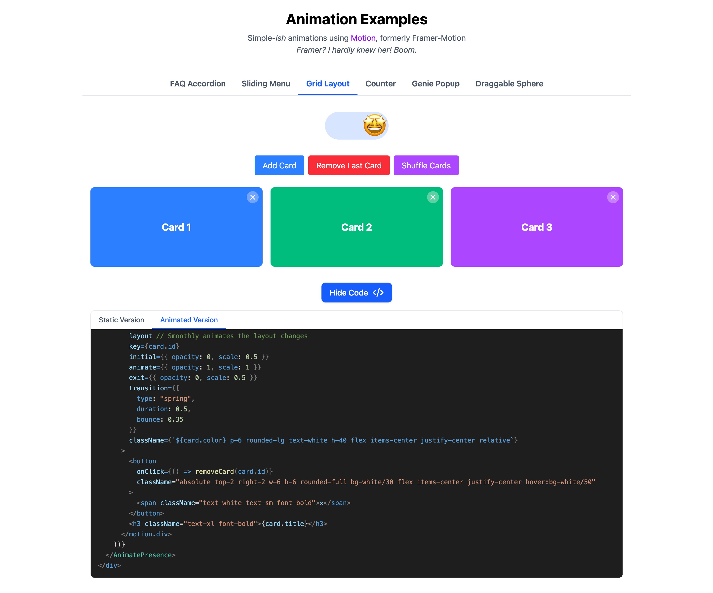

# Animation Examples

A collection of simple-ish animation examples using [Motion](https://motion.dev/).



## About

This project showcases various animation techniques that can be implemented with the Motion library. Each example includes:

- Live interactive demo
- Toggle to enable/disable animations for comparison
- Code viewer to see both the static and animated implementations

## Examples Included

1. **FAQ Accordion** - Smooth height animations for expanding/collapsing content
2. **Sliding Menu** - Off-canvas menu with smooth slide transitions and staggered item animations
3. **Grid Layout** - Animated grid with item transitions when adding, removing or reordering
4. **Counter** - Animated number counter with custom easing
5. **Genie Popup** - Dialog with entrance/exit animations and staggered content
6. **Draggable Sphere** - Interactive element with drag, momentum and elastic constraints

## Getting Started

### Prerequisites

- Node.js (v18+)
- npm or yarn

### Installation

```bash
# Clone the repository
git clone https://github.com/yourusername/animation-examples.git
cd animation-examples

# Install dependencies
npm install
# or
yarn
```

### Development

```bash
# Start the development server
npm run dev
# or
yarn dev
```

Open [http://localhost:5173](http://localhost:5173) to view it in your browser.

### Build

```bash
# Build for production
npm run build
# or
yarn build
```

## Project Structure

```yml
src/
├── components/        # Shared components
│   ├── AnimationToggle.tsx  # Toggle for animations on/off
│   ├── CodeViewer.tsx       # Code example viewer component
│   └── TabSwitcher.tsx      # Navigation between examples
├── examples/          # Animation examples
│   ├── 1.Accordion/
│   ├── 2.SlidingMenu/
│   ├── 3.GridLayout/
│   ├── 4.Counter/
│   ├── 5.Popup/
│   └── 6.DraggableSphere/
└── App.tsx            # Main application component
```
